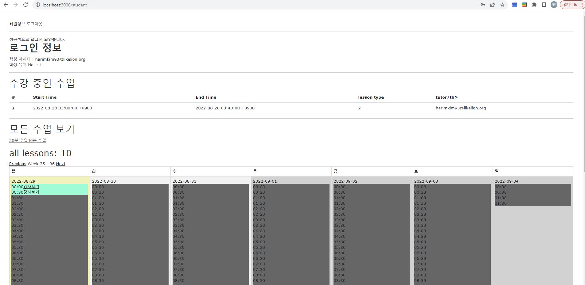

# README

* Ruby version: 2.6.5

* Rails version: 6.0.5.1

* rake db:seed로 데이터 생성 부탁드립니다.(TimeTable)

* student / tutor 회원이 존재 합니다
* tutor는 수업을 생성할 수 있고
* student는 수업에 자신을 등록할 수 있습니다.
* 라이브러리
  * Devise: 회원별 회원 가입
  * devise-i18n: devise 번역을 위한 라이브러리
  * simple_calendar: 프론트에 날짜 및 시간 데이터를 원할하게 보여주기 위한 라이브러리
## 기능 구현
* root 페이지: 
* 로그인 페이지: 
* 튜터 페이지(/tutor) 해당 페이지에서 해당 튜터가 등록한 lesson 확인  및 Timetable에 따른 lesson 등록(프론트에서 등록 가능 링크를 제한함(lesson겹치지 않도록))  
* 튜터 lesson 등록 페이지 등록시 기존에 등록한 lesson을 확인하여 겹치지 않도록 제한 함 겹칠시 /tutor 페이지로 되돌아감. 
* 학생 페이지(/student) 해당 페이지에서 TimeTable에 따른 수강 가능한 시간 확인 (프론트에서 제한) 
* 학생 lesson 등록 페이지: 수강 가능한 시간의 강사보기 클릭시 해당 시간에 등록 가능한 강사 표시  수강신청 클릭시 
* 
## 스펙
* DB: sqlite3
  * tables:
    * TimeTble: 일주일 30분 간격으로 데이터 기준을 잡기 위한 Table, 화면에 데이터 표시, Lesson과 1:N 관계
      * _Columns_
      * start_time: 수업 기준 시간을 잡기 위한 시간(30분 간격으로 생성)
    * Lesson: 실제 수업 - Tutor와 1:N 관계, Student와 1:N 관계
      * _Columns_
      * start_time:timestamp | 등록하는 TimeTable의 시간을 받아와서 저장
      * end_time:timestamp   | lesson_type에 따른 종료 시간
      * lesson_type:integer  | 20분 / 40분 수업 구분
      * tutor_id:integer     | 관계 설정을 위한 컬럼
      * time_table_id:integer | 관계 설정을 위한 컬럼
      * student_id:integer   | 관계 설정을 위한 컬럼
    * Tutor / Student: Devise 승계

## API 명세서
| prefix             | verb | URI                                                      | Return                    |
|--------------------|------|----------------------------------------------------------|---------------------------|
| student            | GET  | /student(.:format)                                       | http status / @timetables |
|                    | GET  | /student/index(.:format)                                 | http status / @timetables |
|                    | POST | /student/lesson/:lesson_id(.:format)                     | http status / @lesson     |
|                    | GET  | /student/time_tables/:time_table_id/lessons(.:format)    | http status / @lessons    |
|                    | GET  | /student/time_tables/:time_table_id/lessons_20(.:format) | http status / @lessons    |
|                    | GET  | /student/time_tables/:time_table_id/lessons_40(.:format) | http status / @lessons    |
|                    | GET  | /student/lesson_20(.:format)                             | http status / @lessons    |
|                    | GET  | /student/lesson_40(.:format)                             | http status / @lessons    |
| tutor              | GET  | /tutor(.:format)                                         | http status / @timetables |
|                    | GET  | /tutor/:id/lessons(.:format)                             | http status / @timetables |
| lesson             | GET  | /lessons/new/:time_table_id(.:format)                    | http status / @lesson     |
| scaffold  lesson   |      |                                                          |                           |
| scaffold timetable |      |                                                          |                           |
| devise student     |      |                                                          |                           |
| devise tutor       |      |                                                          |                           |